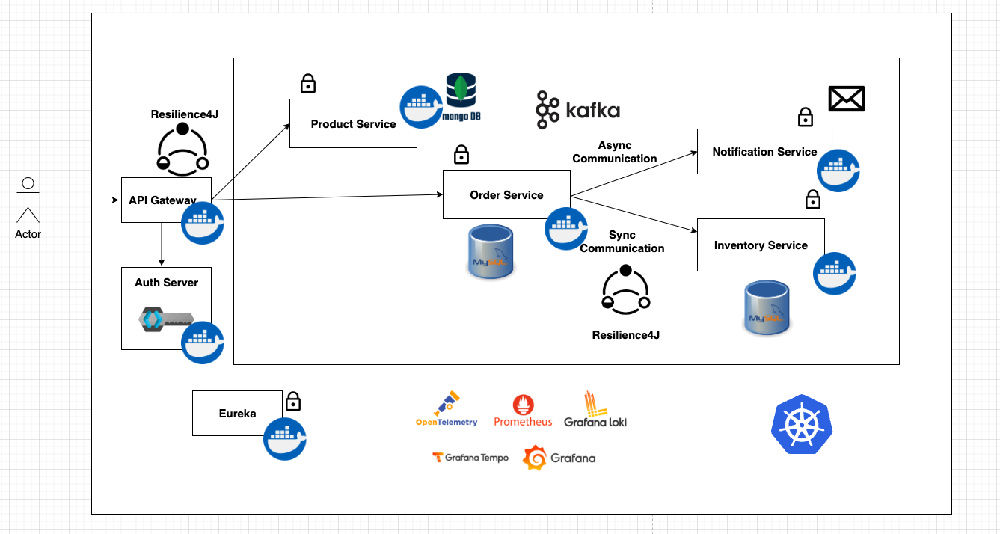

# Microservice Project

## Introduction

Learn to build a microservice application using Java and Spring Boot 3. 
Learn about different aspects of microservice applications and implement them.

**Goals**
1. Building REST based service applications using Spring Boot 3
2. Learn about [Synchronous Inter Service Communication](https://microservices.io/patterns/communication-style/rpi.html) - **Spring Cloud Open Feign**
3. Learn about [Service Discovery](https://microservices.io/patterns/server-side-discovery.html) - **Spring Cloud Netflix Eureka**
4. Learn about [API Gateway](https://microservices.io/patterns/apigateway.html) - **Spring Cloud Gateway**
5. Implement Microservice [Security](https://microservices.io/patterns/security/access-token.html) - **Keycloak**
6. Learn about [Circuit Breaker](https://microservices.io/patterns/reliability/circuit-breaker.html) - **Spring Cloud CircuitBreaker** with **Resilience4J**
7. Learn about [Event Driven Architecture](https://microservices.io/patterns/data/event-driven-architecture.html) - **Kafka**
8. Learn about Observability in microservices
9. Implement [Distributed Tracing](https://microservices.io/patterns/observability/distributed-tracing.html) - **open Telemetry & Grafana Tempo**
10. Learn about [Log Aggregation](https://microservices.io/patterns/observability/application-logging.html) - **Grafana & loki**
11. Collect metrics using **Prometheus** and visualize the metrics using **Grafana**
12. Containerize tha applications using **Docker**
13. Migrate the workloads to **Kubernetes**

**Technologies Used**
1. Java 21
2. Spring Boot 3
3. MongoDB
4. MySQL
5. Docker
6. Kafka
7. Kubernetes

**Tools Used**

1. Intellij IDEA
2. Docker
3. Postman

## Application Overview

Our application contains the following services:
1. **Product Service**
2. **Order Service**
3. **Inventory Service**
4. **Notification Service**

**Architecture Diagram**

